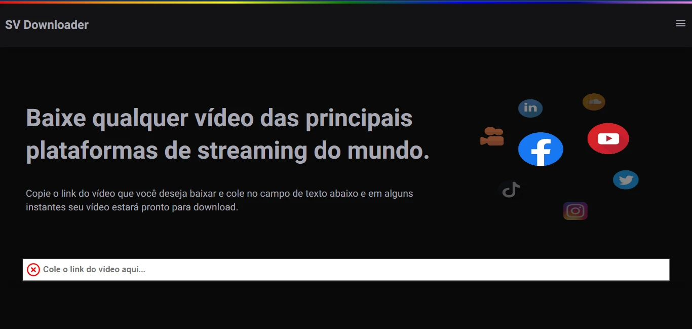
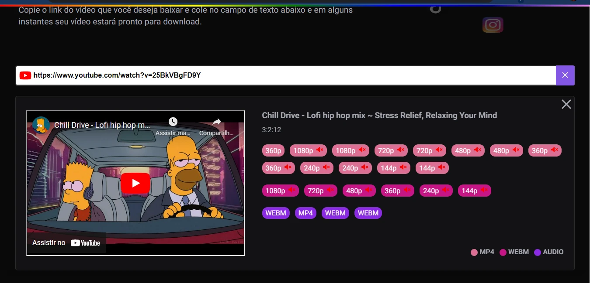

<h1 align="center">
  <strong>Social Video Downloader</strong>
</h1>

🗣👥 Faça download de qualquer vídeo do youtube.

## 🎨 Screens

## ✅ About

- Para fazer download dos vídeos estou utilizando as funções servless do NextJS, mas ela tem um limite de resposta de 4MB impossibilitando fazer download de videos muitos pesados.

## 🧰 Tools

- [React](https://reactjs.org/)
- [NextJS](https://nextjs.org/)
- [Stitches](https://stitches.dev/)

## 🙋‍♂️ Author

- **João Vitor** - [JoaoJustoDev](https://github.com/joaojustodev)
