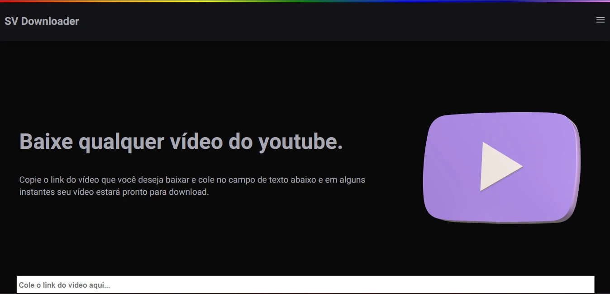

<h1 align="center">
  <strong>Social Video Downloader</strong>
</h1>

<p align="center">
🗣👥 Faça download de qualquer vídeo do youtube.
</p>

## 🎨 Screens




## ✅ About

- Para fazer a busca do vídeo do youtube usei a lib **ytdl**

- Ao colar link do vídeo no input um dispatch é relaizado para redux enviar esse link para **/api/video** que ira fazer validação dessa url e retornar o vídeo em si junto com os links disponível para download.

- Criei um botão para fazer download direto, sem precisar ir no link, mas o nextjs limita a transferência de dados em 5MB.

## 🧰 Tools

- [React](https://reactjs.org/)
- [NextJS](https://nextjs.org/)
- [Redux](https://redux-toolkit.js.org/)
- [Stitches](https://stitches.dev/)

## Install

```bash
  git clone https://github.com/joaojustodev/social-video-downloader

  cd social-video-downloader

  yarn Install

  yarn dev
```

## 🙋‍♂️ Author

- **João Vitor** - [JoaoJustoDev](https://github.com/joaojustodev)
